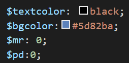
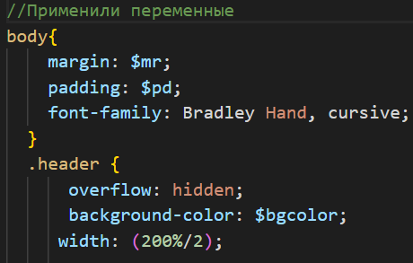
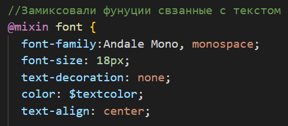
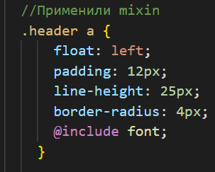
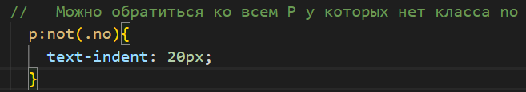

# Используем SCSS

## Преимущества перед CSS

SCSS — "диалект" языка SASS. А что такое SASS? SASS это язык похожий на HAML, но предназначенный для упрощения создания CSS-кода. Рассмотрим несколько преимуществ 
этого диалекта:

## 1. Можно задать параметр переменной и использовать ее в любых целях, т.е. цвет, размеры, функции<
 

## 2. Можно использовать mixin для сочетания разных функций, и после задавать их c помощью команды include разным элементам, это позволяет не тратить время на описание всех функций каждый раз 
 

## 3. Можно обратиться ко всем элементам одной группы, у которых нет какого-либо класса 

